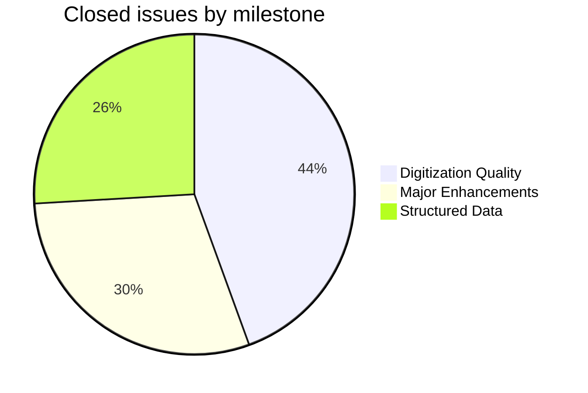
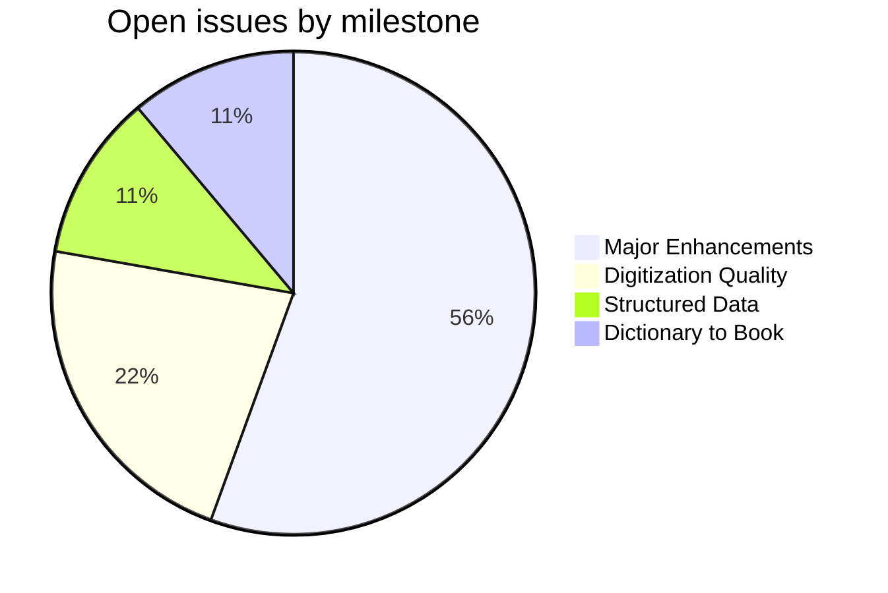
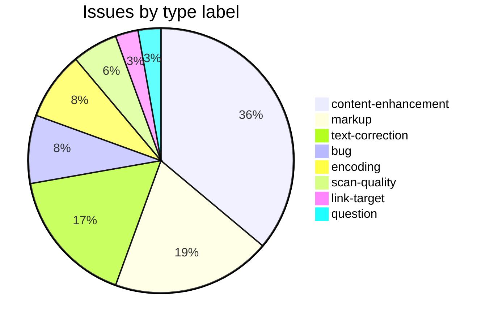

GRA
===

Grassmann, Hermann; *Wörterbuch zum Rig-Veda*. Leipzig, 1873.

This repository holds corrections, enhancements, and tooling for the [Cologne digitization](http://www.sanskrit-lexicon.uni-koeln.de/) of the GRA dictionary. The canonical source data (`gra.txt` in SLP1 encoding) lives in [csl-orig](https://github.com/sanskrit-lexicon/csl-orig); the build system is in [csl-pywork](https://github.com/sanskrit-lexicon/csl-pywork). Issues and corrections are tracked at the [GRA GitHub issue tracker](https://github.com/sanskrit-lexicon/GRA/issues).

## Contents

| Directory | Description |
|-----------|-------------|
| `forward/` | German foreword PDF and English translation drafts |
| `verbs01/` | GRA verb identification and correlation with MW verbs and upasargas |
| `vn/` | VN supplement integration — Grassmann's changes, deletions, additions; `gra-dev/` for gra9 display work |
| `graab/` | CDSL display adaptation for the Andhrabharati version of `gra.txt` |
| `issues/` | Per-issue correction workflows (`issueNNN/` pattern) |

## Timeline

| Period | Milestone |
|--------|-----------|
| Jan 2015 | Repository initialized; source PDF archived |
| Jun 2018 | Forward translation work begun |
| Jan 2020 | Dmitri contributes corrections |
| Apr 2020 | `verbs01` verb pipeline — GRA roots correlated with MW (#11) |
| Jul 2020 | MW/MWS verb correlation refined |
| Apr 2023 | Digitization corrections from Thomas Malten applied (#21) |
| Jun–Jul 2023 | AB version CDSL display series (`graab/`) — #29, #31, #32 |
| Aug 2024 | `grahwextra` → Lbody structural markup (#34) |

## Projects & Milestones

Work is organised into four GitHub Projects (org-level kanban boards), each mirroring a milestone:

| Project | Milestone | Open | Closed | Scope |
|---|---|---|---|---|
| [**Dictionary to Book**](https://github.com/orgs/sanskrit-lexicon/projects/1) | [milestone](https://github.com/sanskrit-lexicon/GRA/milestone/1) | 1 | 0 | Link targets |
| [**Digitization Quality**](https://github.com/orgs/sanskrit-lexicon/projects/2) | [milestone](https://github.com/sanskrit-lexicon/GRA/milestone/2) | 2 | 12 | Scan quality, encoding, bug fixes, text corrections |
| [**Structured Data**](https://github.com/orgs/sanskrit-lexicon/projects/3) | [milestone](https://github.com/sanskrit-lexicon/GRA/milestone/3) | 1 | 7 | Markup normalisation, abbreviation markup, editorial questions |
| [**Major Enhancements**](https://github.com/orgs/sanskrit-lexicon/projects/4) | [milestone](https://github.com/sanskrit-lexicon/GRA/milestone/4) | 5 | 8 | Display upgrades, VN supplement, AB version integration |

## Issue Typology

Issues track two broad concerns: **enriching the XML markup** (abbreviations, link targets) and **improving the digitization** (encoding, scan quality, text corrections).

#### Solved (closed issues)

| Type | Count | Description | Examples |
|---|---|---|---|
| **Text corrections** | 6 | Digitization corrections, German spelling typos, AB version corrections | Malten corrections [#21](https://github.com/sanskrit-lexicon/GRA/issues/21), AB corrections [#25](https://github.com/sanskrit-lexicon/GRA/issues/25), [#30](https://github.com/sanskrit-lexicon/GRA/issues/30) |
| **Content enhancement** | 8 | AB version CDSL display, VN supplement, verb pipeline, internal links | CDSL AB display [#29](https://github.com/sanskrit-lexicon/GRA/issues/29), [#31](https://github.com/sanskrit-lexicon/GRA/issues/31), [#32](https://github.com/sanskrit-lexicon/GRA/issues/32), verbs01 [#11](https://github.com/sanskrit-lexicon/GRA/issues/11) |
| **Markup** | 7 | `<ab>` and `<ls>` abbreviation tooltips, startup files, `grahwextra` → Lbody structural change | Abbr. markup [#27](https://github.com/sanskrit-lexicon/GRA/issues/27), Lbody [#34](https://github.com/sanskrit-lexicon/GRA/issues/34), abbr tooltips [#8](https://github.com/sanskrit-lexicon/GRA/issues/8) |
| **Encoding** | 2 | Accent encoding, accented semivowels | Semivowels [#20](https://github.com/sanskrit-lexicon/GRA/issues/20), key tags [#1](https://github.com/sanskrit-lexicon/GRA/issues/1) |
| **Scan quality** | 2 | Improved scans, missing annexure pages | Improved scans [#19](https://github.com/sanskrit-lexicon/GRA/issues/19), missing pages [#17](https://github.com/sanskrit-lexicon/GRA/issues/17) |
| **Bug fixes** | 2 | Display format errors, page errors | Page 570 [#15](https://github.com/sanskrit-lexicon/GRA/issues/15), AV links [#3](https://github.com/sanskrit-lexicon/GRA/issues/3) |

#### Open (work ahead)

| Type | Count | Description | Examples |
|---|---|---|---|
| **Content enhancement** | 5 | Display revisions, pada-pāṭha, supplemental list display, Wikisource footnotes | Supplemental display [#33](https://github.com/sanskrit-lexicon/GRA/issues/33), pada-pāṭha [#14](https://github.com/sanskrit-lexicon/GRA/issues/14), footnotes [#35](https://github.com/sanskrit-lexicon/GRA/issues/35) |
| **Encoding** | 1 | Missing m̐ character in RV transliteration | m̐ vs ṃ [#24](https://github.com/sanskrit-lexicon/GRA/issues/24) |
| **Bug fixes** | 1 | Display format errors | x.y.z display [#22](https://github.com/sanskrit-lexicon/GRA/issues/22) |
| **Link targets** | 1 | Bibliographical references at rvlinks | rvlinks [#36](https://github.com/sanskrit-lexicon/GRA/issues/36) |
| **Questions** | 1 | Sandhi encoding question | eṣām sandhi [#13](https://github.com/sanskrit-lexicon/GRA/issues/13) |

## Labels

Every issue carries one **type** label and one **severity** label.

#### Type

| Label | Meaning |
|---|---|
| `link-target` | Building a click-through from a `<ls>` abbreviation to scanned PDF pages |
| `link-splitting` | Splitting combined `SOURCE N,N` refs into individual per-page links |
| `markup` | Normalising XML tag content or structure (`<ls>`, `<ab>`, `<lex>`, abbreviation tooltips) |
| `text-correction` | Corrections to German definitions, Sanskrit headwords, or digitization errors |
| `content-enhancement` | New material, display upgrades, or structural additions beyond correction |
| `encoding` | Accent encoding, character rendering, SLP1/IAST transcoding |
| `scan-quality` | Replacing blurry, skewed, or missing scan pages |
| `bug` | Broken display, XML structure errors, broken links |
| `question` | Scholarly or editorial questions requiring research before any code change |

#### Severity

| Label | Meaning |
|---|---|
| `minor` | Targeted, self-contained fix — a handful of entries or a single file |
| `medium` | Standard unit of work — one link-target index, a batch of corrections |
| `hard` | Large effort spanning many sources, files, or dictionaries |

## Contributors

- **Jim Funderburk** ([@funderburkjim](https://github.com/funderburkjim)) — primary repository maintainer; tooling and correction workflows
- **Thomas Malten** ([@maltenth](https://github.com/maltenth)) — initial digitization corrections (#21)
- **Andhrabharati** (Nagabhushana Rao) — AB version of `gra.txt`; CDSL display data (#29–#32)
- **Mārcis Gasūns** ([@gasyoun](https://github.com/gasyoun)) — initial commit and early data work

