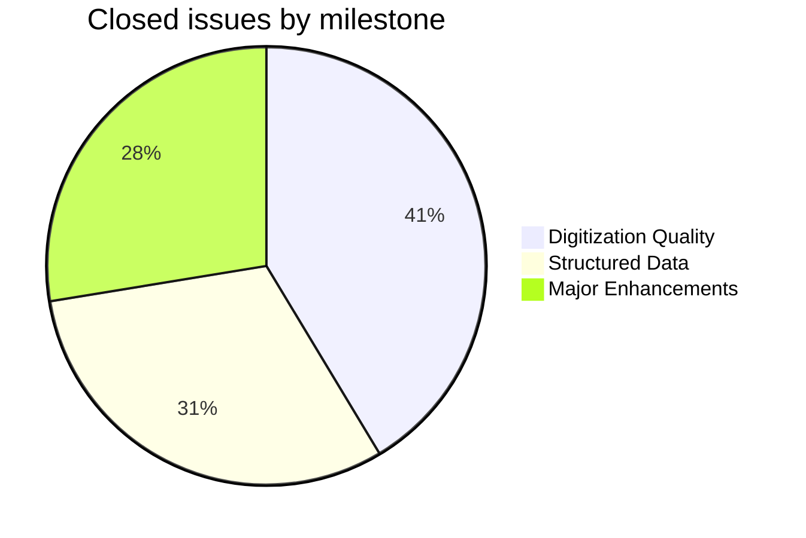
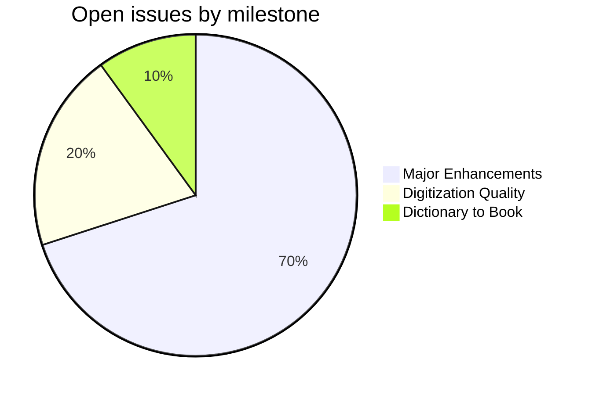
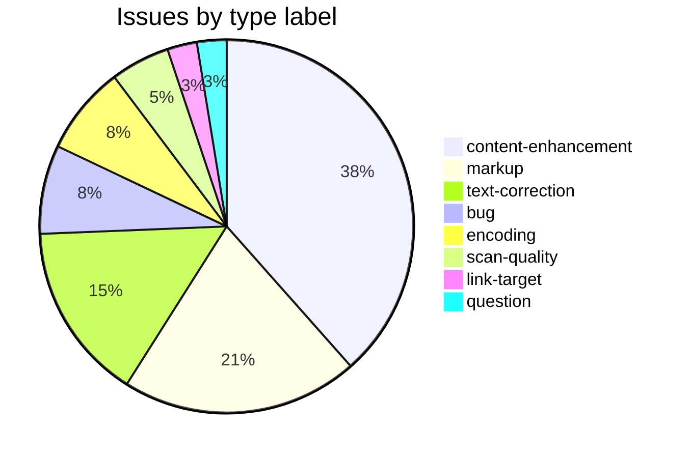

GRA
===

_Created: 08-01-2020 · Last updated: 11-07-2026_

Grassmann, Hermann; *Wörterbuch zum Rig-Veda*. Leipzig, 1873.

This repository holds corrections, enhancements, and tooling for the [Cologne digitization](https://www.sanskrit-lexicon.uni-koeln.de/) of the GRA dictionary. The canonical source data (`gra.txt`, with SLP1 headword keys) lives in [csl-orig](https://github.com/sanskrit-lexicon/csl-orig); the build system is in [csl-pywork](https://github.com/sanskrit-lexicon/csl-pywork). Issues and corrections are tracked at the [GRA GitHub issue tracker](https://github.com/sanskrit-lexicon/GRA/issues).

**Landing page:** [sanskrit-lexicon.github.io/GRA](https://sanskrit-lexicon.github.io/GRA/) — a GitHub Pages overview of the dictionary, linking to the live Cologne web interface and this repository.

## Contents

| Directory | Description |
|-----------|-------------|
| [`forward/`](https://github.com/sanskrit-lexicon/GRA/tree/main/forward) | German foreword PDF and English translation drafts |
| [`verbs01/`](https://github.com/sanskrit-lexicon/GRA/tree/main/verbs01) | GRA verb identification and correlation with MW verbs and upasargas |
| [`vn/`](https://github.com/sanskrit-lexicon/GRA/tree/main/vn) | VN supplement integration — Grassmann's changes, deletions, additions; `gra-dev/` for gra9 display work |
| [`graab/`](https://github.com/sanskrit-lexicon/GRA/tree/main/graab) | CDSL display adaptation for the Andhrabharati version of `gra.txt` |
| [`issues/`](https://github.com/sanskrit-lexicon/GRA/tree/main/issues) | Per-issue correction workflows (`issueNNN/` pattern) |
| [`prefaces/`](https://github.com/sanskrit-lexicon/GRA/tree/main/prefaces) | Front matter (title page + foreword) — OCR transcription with English and Russian translations; see [prefaces/README.md](https://github.com/sanskrit-lexicon/GRA/blob/main/prefaces/README.md) |

## Front matter (prefaces)

The dictionary's [front matter](https://github.com/sanskrit-lexicon/GRA/tree/main/prefaces) — the 1873 title page and Grassmann's foreword (Stettin, 10 August 1872) — has been transcribed from the Cologne scan pages into faithful Markdown (original 19th-c. orthography), with **English** and **Russian** translations of every page and consolidated single-file editions per language:

- German source: [prefaces/grapref_all.de.md](https://github.com/sanskrit-lexicon/GRA/blob/main/prefaces/grapref_all.de.md)
- English: [prefaces/grapref_all.en.md](https://github.com/sanskrit-lexicon/GRA/blob/main/prefaces/grapref_all.en.md) (foreword translation by Dr. Felix Rau, University of Cologne, 2018)
- Russian: [prefaces/grapref_all.ru.md](https://github.com/sanskrit-lexicon/GRA/blob/main/prefaces/grapref_all.ru.md)

## Usage example

A real entry from [`csl-orig/v02/gra/gra.txt`](https://github.com/sanskrit-lexicon/csl-orig/blob/master/v02/gra/gra.txt) (line 4, headword *áṃśa*, German definition with Rig-Veda passage citations):

```
<L>4<pc>0001<k1>aMSa<k2>a/MSa
{@áṃśa,@}¦ <ab>m.</ab>, das als Antheil erlangte (<ab n="siehe">s.</ab> <hom>1.</hom> aś), daher 1〉  2〉  3〉  4〉  oder  und daher 5〉 Name eines der Aditisöhne.
<div n="TS">-as 1〉 {548,12}. 5〉 {192,4}; {218,1}; {396,5}.
<LEND>
```

To fix a typo in the German gloss (e.g. `Antheil` → `Anteil` under modern orthography), a change file addresses line 4 with the old/new text:

```
4 old {@áṃśa,@}¦ <ab>m.</ab>, das als Antheil erlangte (<ab n="siehe">s.</ab> <hom>1.</hom> aś), daher 1〉  2〉  3〉  4〉  oder  und daher 5〉 Name eines der Aditisöhne.
4 new {@áṃśa,@}¦ <ab>m.</ab>, das als Anteil erlangte (<ab n="siehe">s.</ab> <hom>1.</hom> aś), daher 1〉  2〉  3〉  4〉  oder  und daher 5〉 Name eines der Aditisöhne.
```

```sh
python updateByLine.py gra.txt change_gra_N.txt gra_corrected.txt
```

Corrections are never edited directly into the source; they are expressed as change files and applied by scripts. The full 8-stage change-file workflow (snapshot → `updateByLine.py` → promote → generate → XML-validate → audit → commit → refresh) and every gotcha (BOM, `<LEND>`, CRLF, line-count mismatch) live in the canonical [correction-workflow doc](https://github.com/sanskrit-lexicon/csl-corrections/blob/main/docs/correction-workflow.md).

## Timeline

| Period | Milestone |
|--------|-----------|
| Jan 2015 | Repository initialized; source PDF archived |
| Jun 2018 | Forward translation work begun |
| Jan 2020 | Dmitri contributes corrections |
| Apr 2020 | `verbs01` verb pipeline — GRA roots correlated with MW (#11) |
| Jul 2020 | MW/MWS verb correlation refined |
| Apr 2023 | Digitization corrections from Thomas Malten applied (#21) |
| Jun–Jul 2023 | AB version CDSL display series (`graab/`) — #29, #31, #32 |
| Aug 2024 | `grahwextra` → Lbody structural markup (#34) |

## Projects & Milestones

Work is organised into four GitHub Projects (org-level kanban boards), each mirroring a milestone:

| Project | Milestone | Open | Closed | Scope |
|---|---|---|---|---|
| [**Dictionary to Book**](https://github.com/orgs/sanskrit-lexicon/projects/1) | [milestone](https://github.com/sanskrit-lexicon/GRA/milestone/1) | 1 | 0 | Link targets |
| [**Digitization Quality**](https://github.com/orgs/sanskrit-lexicon/projects/2) | [milestone](https://github.com/sanskrit-lexicon/GRA/milestone/2) | 2 | 12 | Scan quality, encoding, bug fixes, text corrections |
| [**Structured Data**](https://github.com/orgs/sanskrit-lexicon/projects/3) | [milestone](https://github.com/sanskrit-lexicon/GRA/milestone/3) | 0 | 9 | Markup normalisation, abbreviation markup, editorial questions |
| [**Major Enhancements**](https://github.com/orgs/sanskrit-lexicon/projects/4) | [milestone](https://github.com/sanskrit-lexicon/GRA/milestone/4) | 7 | 8 | Display upgrades, VN supplement, AB version integration |

Counts above are live as of 11-07-2026: 10 issues open, 29 closed.


```mermaid
pie title Closed issues by milestone
    "Digitization Quality" : 12
    "Structured Data" : 9
    "Major Enhancements" : 8
```


```mermaid
pie title Open issues by milestone
    "Major Enhancements" : 7
    "Digitization Quality" : 2
    "Dictionary to Book" : 1
```

## Issue Typology

Issues track two broad concerns: **enriching the XML markup** (abbreviations, link targets) and **improving the digitization** (encoding, scan quality, text corrections).


```mermaid
pie title Issues by type label
    "content-enhancement" : 15
    "markup" : 8
    "text-correction" : 6
    "bug" : 3
    "encoding" : 3
    "scan-quality" : 2
    "link-target" : 1
    "question" : 1
```

#### Solved (closed issues)

| Type | Count | Description | Examples |
|---|---|---|---|
| **Content enhancement** | 8 | AB version CDSL display, VN supplement, internal links | CDSL AB display [#29](https://github.com/sanskrit-lexicon/GRA/issues/29), [#31](https://github.com/sanskrit-lexicon/GRA/issues/31), [#32](https://github.com/sanskrit-lexicon/GRA/issues/32) |
| **Markup** | 8 | `<ab>` and `<ls>` abbreviation tooltips, startup files, `grahwextra` → Lbody structural change | Abbr. markup [#27](https://github.com/sanskrit-lexicon/GRA/issues/27), Lbody [#34](https://github.com/sanskrit-lexicon/GRA/issues/34), abbr tooltips [#8](https://github.com/sanskrit-lexicon/GRA/issues/8) |
| **Text corrections** | 6 | Digitization corrections, German spelling typos, AB version corrections | Malten corrections [#21](https://github.com/sanskrit-lexicon/GRA/issues/21), AB corrections [#25](https://github.com/sanskrit-lexicon/GRA/issues/25), [#30](https://github.com/sanskrit-lexicon/GRA/issues/30) |
| **Encoding** | 2 | Accent encoding, accented semivowels | Semivowels [#20](https://github.com/sanskrit-lexicon/GRA/issues/20), key tags [#1](https://github.com/sanskrit-lexicon/GRA/issues/1) |
| **Scan quality** | 2 | Improved scans, missing annexure pages | Improved scans [#19](https://github.com/sanskrit-lexicon/GRA/issues/19), missing pages [#17](https://github.com/sanskrit-lexicon/GRA/issues/17) |
| **Bug fixes** | 2 | Display format errors, page errors | Page 570 [#15](https://github.com/sanskrit-lexicon/GRA/issues/15), AV links [#3](https://github.com/sanskrit-lexicon/GRA/issues/3) |
| **Questions** | 1 | Resolved editorial/encoding questions | eṣām sandhi [#13](https://github.com/sanskrit-lexicon/GRA/issues/13) |

#### Open (work ahead)

| Type | Count | Description | Examples |
|---|---|---|---|
| **Content enhancement** | 7 | VedaWeb deep links, docs review, supplemental list display, pada-pāṭha, Wikisource footnotes, verbs01, antonym interlinking | VedaWeb crosswalk [#52](https://github.com/sanskrit-lexicon/GRA/issues/52), docs-pass [#38](https://github.com/sanskrit-lexicon/GRA/issues/38), footnotes [#35](https://github.com/sanskrit-lexicon/GRA/issues/35), supplemental display [#33](https://github.com/sanskrit-lexicon/GRA/issues/33), pada-pāṭha [#14](https://github.com/sanskrit-lexicon/GRA/issues/14), verbs01 [#11](https://github.com/sanskrit-lexicon/GRA/issues/11), antonym interlinking [#4](https://github.com/sanskrit-lexicon/GRA/issues/4) |
| **Encoding** | 1 | Missing m̐ character in RV transliteration | m̐ vs ṃ [#24](https://github.com/sanskrit-lexicon/GRA/issues/24) |
| **Bug fixes** | 1 | Display format errors | x.y.z display [#22](https://github.com/sanskrit-lexicon/GRA/issues/22) |
| **Link targets** | 1 | Bibliographical references at rvlinks | rvlinks [#36](https://github.com/sanskrit-lexicon/GRA/issues/36) |

## Labels

Every issue carries one **type** label and one **severity** label.

#### Type

| Label | Meaning |
|---|---|
| `link-target` | Building a click-through from a `<ls>` abbreviation to scanned PDF pages |
| `link-splitting` | Splitting combined `SOURCE N,N` refs into individual per-page links |
| `markup` | Normalising XML tag content or structure (`<ls>`, `<ab>`, `<lex>`, abbreviation tooltips) |
| `text-correction` | Corrections to German definitions, Sanskrit headwords, or digitization errors |
| `content-enhancement` | New material, display upgrades, or structural additions beyond correction |
| `encoding` | Accent encoding, character rendering, SLP1/IAST transcoding |
| `scan-quality` | Replacing blurry, skewed, or missing scan pages |
| `bug` | Broken display, XML structure errors, broken links |
| `question` | Scholarly or editorial questions requiring research before any code change |

#### Severity

| Label | Meaning |
|---|---|
| `minor` | Targeted, self-contained fix — a handful of entries or a single file |
| `medium` | Standard unit of work — one link-target index, a batch of corrections |
| `hard` | Large effort spanning many sources, files, or dictionaries |

## Contributors

- **Jim Funderburk** ([@funderburkjim](https://github.com/funderburkjim)) — primary repository maintainer; tooling and correction workflows
- **Thomas Malten** ([@maltenth](https://github.com/maltenth)) — initial digitization corrections (#21)
- **Nagabhushana Rao** (@Andhrabharati) — AB version of `gra.txt`; CDSL display data (#29–#32)
- **Mārcis Gasūns** ([@gasyoun](https://github.com/gasyoun)) — initial commit and early data work

_Dr. Mārcis Gasūns_

